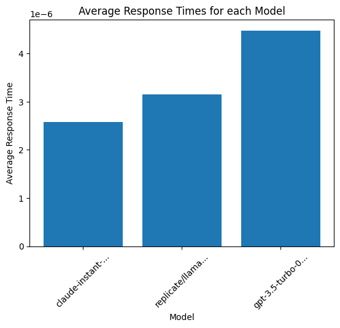
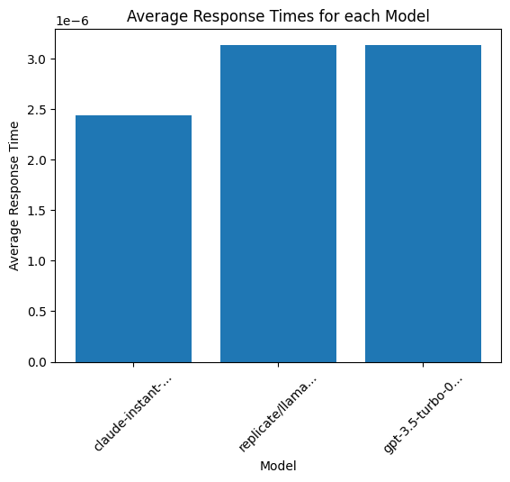

# Reliability test Multiple LLM Providers with LiteLLM


*   Quality Testing
*   Load Testing
*   Duration Testing


```bash
uv add litellm python-dotenv
```


```python
import litellm
from litellm.utils import load_test_model
import time
```


```python
from dotenv import load_dotenv
load_dotenv()
```

## Quality Test endpoint

### Test the same prompt across multiple LLM providers

In this example, let's ask some questions about Paul Graham


```python
models = ["{{openai_small}}", "{{openai_large}}", "{{anthropic}}", "replicate/llama-2-70b-chat:58d078176e02c219e11eb4da5a02a7830a283b14cf8f94537af893ccff5ee781"]
context = """Paul Graham (/ɡræm/; born 1964)[3] is an English computer scientist, essayist, entrepreneur, venture capitalist, and author. He is best known for his work on the programming language Lisp, his former startup Viaweb (later renamed Yahoo! Store), cofounding the influential startup accelerator and seed capital firm Y Combinator, his essays, and Hacker News. He is the author of several computer programming books, including: On Lisp,[4] ANSI Common Lisp,[5] and Hackers & Painters.[6] Technology journalist Steven Levy has described Graham as a "hacker philosopher".[7] Graham was born in England, where he and his family maintain permanent residence. However he is also a citizen of the United States, where he was educated, lived, and worked until 2016."""
prompts = ["Who is Paul Graham?", "What is Paul Graham known for?" , "Is paul graham a writer?" , "Where does Paul Graham live?", "What has Paul Graham done?"]
messages =  [[{"role": "user", "content": context + "\n" + prompt}] for prompt in prompts] # pass in a list of messages we want to test
result = [litellm.batch_completion_models_all_responses(models=models, messages=message) for message in messages]
```

`batch_completion_models_all_responses` sends one conversation to every model in parallel and returns the responses that succeeded, so loop over the prompts. Models that raise are dropped from the returned list rather than surfaced as errors


## Load Test endpoint

Run 100+ simultaneous queries across multiple providers to see when they fail + impact on latency. `load_test_model` takes a single `model`, so call it once per provider.


```python
models=["{{openai_small}}", "replicate/llama-2-70b-chat:58d078176e02c219e11eb4da5a02a7830a283b14cf8f94537af893ccff5ee781", "{{anthropic}}"]
context = """Paul Graham (/ɡræm/; born 1964)[3] is an English computer scientist, essayist, entrepreneur, venture capitalist, and author. He is best known for his work on the programming language Lisp, his former startup Viaweb (later renamed Yahoo! Store), cofounding the influential startup accelerator and seed capital firm Y Combinator, his essays, and Hacker News. He is the author of several computer programming books, including: On Lisp,[4] ANSI Common Lisp,[5] and Hackers & Painters.[6] Technology journalist Steven Levy has described Graham as a "hacker philosopher".[7] Graham was born in England, where he and his family maintain permanent residence. However he is also a citizen of the United States, where he was educated, lived, and worked until 2016."""
prompt = "Where does Paul Graham live?"
final_prompt = context + prompt
num_calls = 5
result = {model: load_test_model(model=model, prompt=final_prompt, num_calls=num_calls) for model in models}
```

`load_test_model` sends `num_calls` requests concurrently, but the `calls_made` field it returns is always 100 whatever `num_calls` is, so divide by your own `num_calls` when averaging

### Visualize the data


```python
import matplotlib.pyplot as plt

## calculate avg response time
avg_response_time = {}
for model, load_result in result.items():
    avg_response_time[model] = load_result["total_response_time"] / num_calls

models = list(avg_response_time.keys())
response_times = list(avg_response_time.values())

plt.bar(models, response_times)
plt.xlabel('Model', fontsize=10)
plt.ylabel('Average Response Time')
plt.title('Average Response Times for each Model')

plt.xticks(models, [model[:15]+'...' if len(model) > 15 else model for model in models], rotation=45)
plt.show()
```


    

    


## Duration Test endpoint

Run load testing for 2 mins. Hitting endpoints with 100+ queries every 15 seconds. `load_test_model` has no interval or duration options, so loop over it yourself.


```python
models=["{{openai_small}}", "replicate/llama-2-70b-chat:58d078176e02c219e11eb4da5a02a7830a283b14cf8f94537af893ccff5ee781", "{{anthropic}}"]
context = """Paul Graham (/ɡræm/; born 1964)[3] is an English computer scientist, essayist, entrepreneur, venture capitalist, and author. He is best known for his work on the programming language Lisp, his former startup Viaweb (later renamed Yahoo! Store), cofounding the influential startup accelerator and seed capital firm Y Combinator, his essays, and Hacker News. He is the author of several computer programming books, including: On Lisp,[4] ANSI Common Lisp,[5] and Hackers & Painters.[6] Technology journalist Steven Levy has described Graham as a "hacker philosopher".[7] Graham was born in England, where he and his family maintain permanent residence. However he is also a citizen of the United States, where he was educated, lived, and worked until 2016."""
prompt = "Where does Paul Graham live?"
final_prompt = context + prompt
interval = 15
duration = 120
result = []
num_calls = 100
end_time = time.time() + duration
while time.time() < end_time:
    result.append({model: load_test_model(model=model, prompt=final_prompt, num_calls=num_calls) for model in models})
    time.sleep(interval)
```


```python
import matplotlib.pyplot as plt

## calculate avg response time
model_dict = {model: {"response_time": []} for model in models}
for iteration in result:
  for model, load_result in iteration.items():
    model_dict[model]["response_time"].append(load_result["total_response_time"] / num_calls)

avg_response_time = {}
for model, data in model_dict.items():
    avg_response_time[model] = sum(data["response_time"]) / len(data["response_time"])

models = list(avg_response_time.keys())
response_times = list(avg_response_time.values())

plt.bar(models, response_times)
plt.xlabel('Model', fontsize=10)
plt.ylabel('Average Response Time')
plt.title('Average Response Times for each Model')

plt.xticks(models, [model[:15]+'...' if len(model) > 15 else model for model in models], rotation=45)
plt.show()
```


    

    

